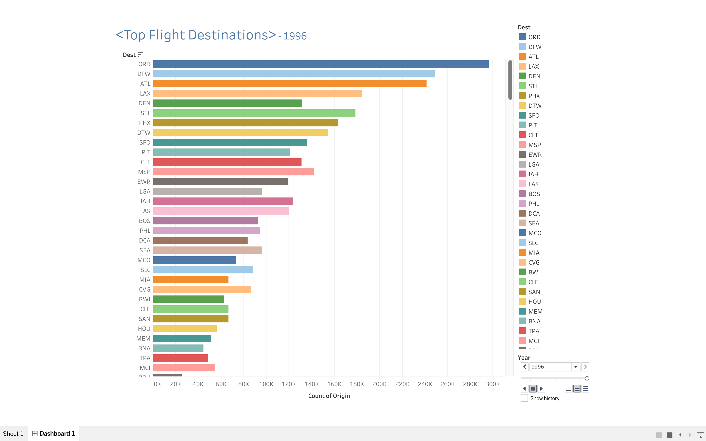
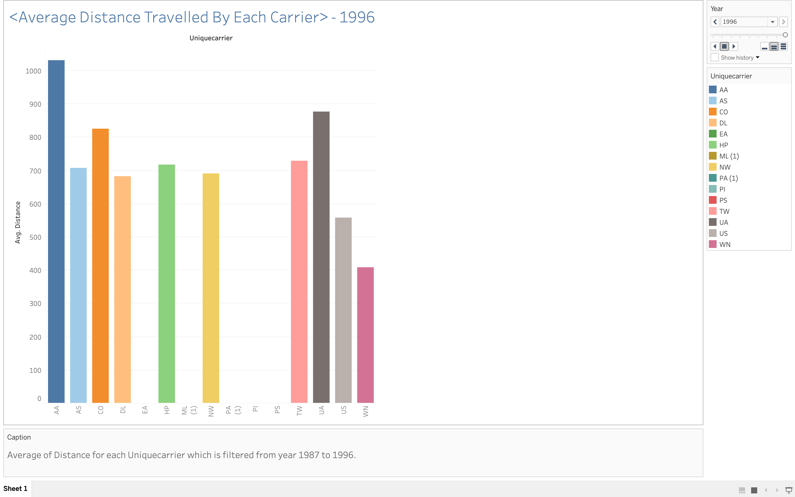
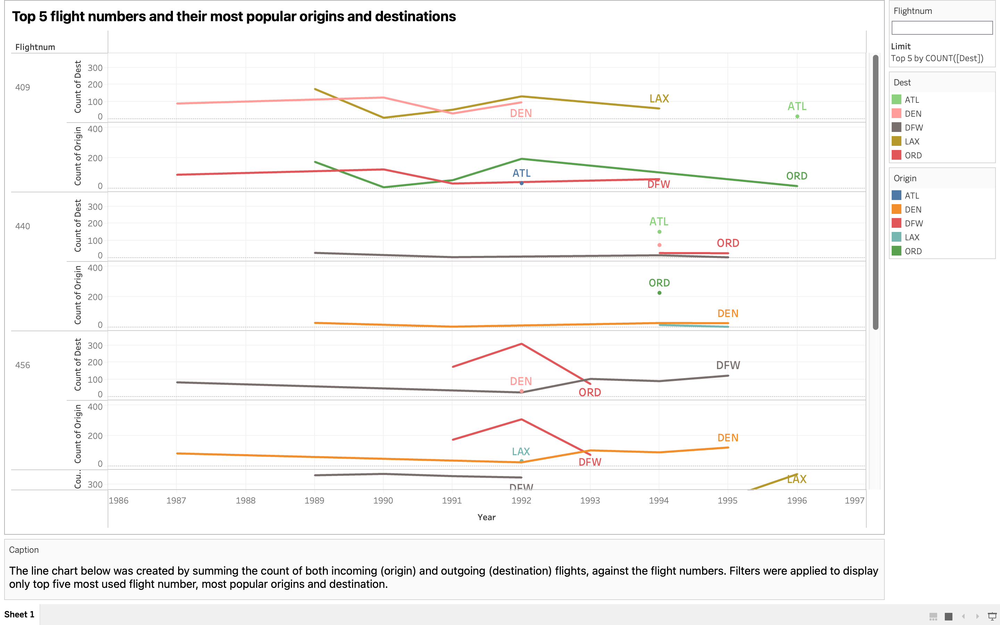
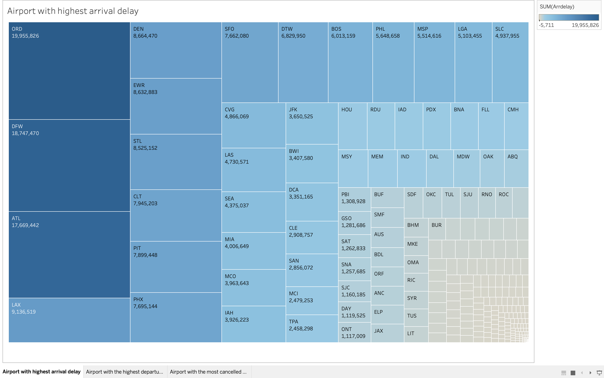
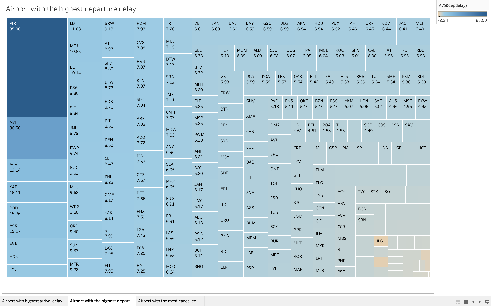
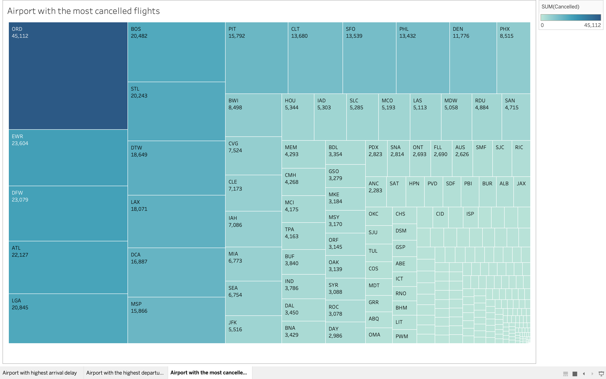

# Data Analytics Migration to Tableau

A comprehensive data analytics migration project for Skyscanner, starting from ingesting and cleaning the large flight dataset using Pandas, then loading the cleaned data into a PostgreSQL database on AWS RDS, and finally integrating the database with Tableau for real-time visualizations and dashboards. 

1. Setting up the environment:
    - Created a GitHub repository linked to VScode for version control and collaborative development: By setting up a GitHub repository, it ensured that the project was properly version-controlled and enabled easy collaboration with other team members if needed. This allowed for efficient code sharing, tracking changes, and managing different project versions.
    - Set up AWS to utilize cloud services, specifically AWS RDS, for PostgreSQL database hosting: Amazon Web Services (AWS) provides a range of cloud services, including the Relational Database Service (RDS). By setting up AWS and leveraging its infrastructure to host a PostgreSQL database for the project. AWS RDS offers scalability, reliability, and easy management of database instances in the cloud.

2. Data Wrangling and Cleaning:
    - Loaded the flight data in CSV format into Pandas dataframes: Used the Pandas library to read the flight data from CSV files into dataframes. Pandas is a powerful data manipulation tool that allows for easy handling of structured data, enabling me to perform various data cleaning and transformation tasks.
    - Sampled a subset of the data due to memory constraints on my machine: Given the large size of the dataset containing millions of records, faced with memory limitations on my local machine. To overcome this, the programmer randomly sampled a subset of the data, selecting 10% of the records from each CSV file. This sampling approach allowed me to work with a manageable amount of data while still capturing its representative characteristics.
    - Checked for NULL values in the data and removed columns with NULL or NA in all records: NULL values or missing data can hinder accurate analysis. To ensure data quality, I examined the dataframes for NULL values using Pandas. Columns that contained NULL or NA values in all records were identified and subsequently removed from the dataframes. This step helps eliminate irrelevant or incomplete information from the dataset.
    - Replaced remaining NULL values with zeros: For the remaining NULL values that were not removed in the previous step and replaced them with zeros. This process ensures that the data is complete and consistent, allowing for accurate analysis and computations.
    - Integrated the data by ensuring all dataframes had the same number of columns and types: To combine the separate dataframes into a cohesive master dataframe, it was crucial to align their structures. All dataframes where verified to make sure they had the same number of columns and consistent column types. This alignment facilitates easy merging or concatenation of the dataframes into a unified dataset.
    - Exported the cleaned and integrated data to a new CSV file named "combined_data.csv": After performing data cleaning and integration, and exported the final master dataframe containing the cleaned and transformed data to a new CSV file. This file, named "combined_data.csv," served as a consolidated dataset for further analysis and visualization.
    - Stored the "combined_data.csv" file in my AWS S3 bucket for easy access and backup: AWS Simple Storage Service (S3) provides secure and scalable object storage in the cloud. By storing the "combined_data.csv" file in my AWS S3 bucket, I ensured easy access to the data from various services and applications. Additionally, storing the file in AWS S3 offered data redundancy and backup capabilities, enhancing data security and reliability.

3. PostgreSQL RDS data import and reporting:
    - Copied the AWS RDS endpoint address for connecting to PostgreSQL: The AWS RDS endpoint address uniquely identifies my PostgreSQL database instance hosted in AWS. By copying this endpoint address, I obtained the necessary information to establish a connection to my PostgreSQL database.
    - Created a new server called "production_server" in pgAdmin4 and connected it to the PostgreSQL RDS using the endpoint address: pgAdmin4 is a popular open-source administration and development platform for PostgreSQL databases. Utilizing pgAdmin4 to create a new server named "production_server" and connected it to my PostgreSQL RDS instance using the previously copied endpoint address. This step enabled me to interact with the database and perform administrative tasks.
    - Created a database named "flights_analytics_database" in the PostgreSQL RDS: Within the connected PostgreSQL RDS instance, and created a new database called "flights_analytics_database." This database served as the dedicated storage for my flight analytics data.
    - Created a new table named "flights" in the database with the same columns and types as "combined_data.csv": To organize and structure the data within the "flights_analytics_database," then created a new table named "flights." The table was designed to mirror the structure of the "combined_data.csv" file, with matching columns and data types. This step ensures data consistency and facilitates seamless data import.
    - Imported the "combined_data.csv" file into the "flights" table: With the table structure in place, and imported the data from the "combined_data.csv" file into the "flights" table. This step populated the table with the cleaned and integrated flight data, making it ready for analysis and reporting within the PostgreSQL database.

4. Integrated Tableau Desktop with PostgreSQL:
    - Downloaded and installed Tableau Desktop, a powerful data visualization and reporting tool: Tableau Desktop is a widely-used software tool for creating interactive data visualizations, dashboards, and reports. By downloading and installing Tableau Desktop, allowed access to a comprehensive platform for visualizing and exploring my flight data.
    - Configured the PostgreSQL connector in Tableau and connected it to the "flights_analytics_database" in RDS: Tableau Desktop provides connectors for various data sources, including PostgreSQL. By configuring the PostgreSQL connector in Tableau and established a connection to the "flights_analytics_database" in my AWS RDS instance. This connection allowed me to access and query the flight data directly from Tableau for visualization purposes.

5. Created Tableau reports:
    - Developed Tableau reports to visualize various aspects of the flight data: Using the functionalities of Tableau Desktop, and created informative and visually appealing reports to analyze and present insights from the flight data. The reports covered different aspects, such as historical flight origins and destinations, average distance traveled by flights, most used flight numbers, and flight delays and cancellations. These reports provide top management with valuable visualizations and interactive dashboards for strategic decision-making based on real-time data. 
    
    
    
    
    
    

